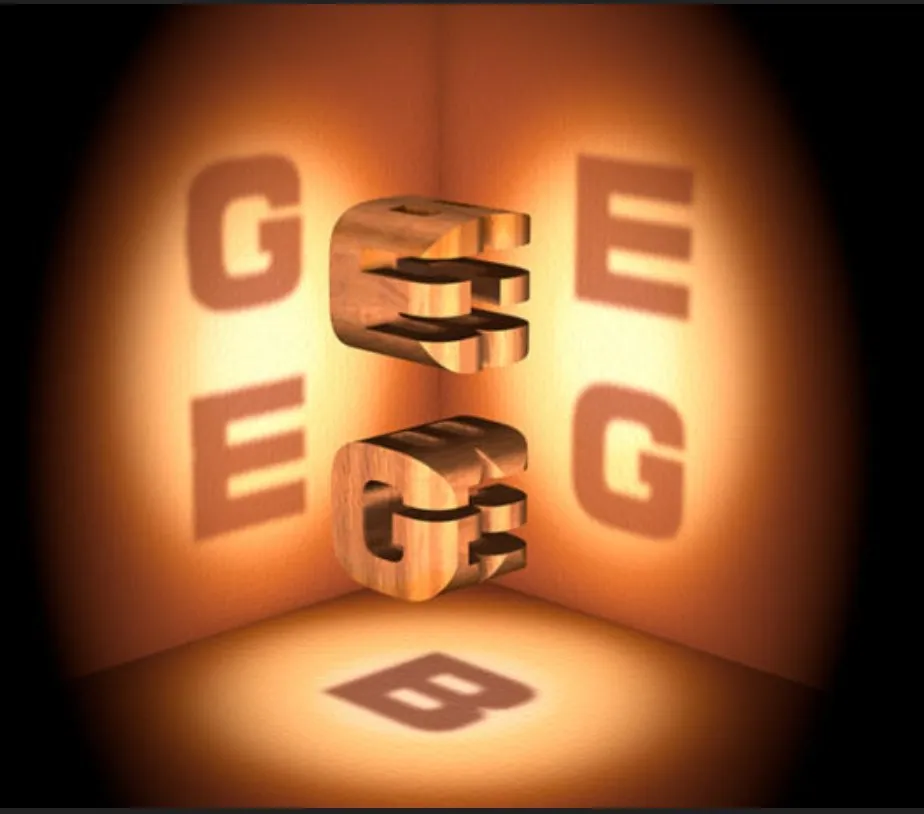

<!-- https://pandoc.org/MANUAL.html -->
\newcommand{\defeq}{\stackrel{\textup{def}}{=}}
\newcommand{\U}{\mathcal{U}}
\newcommand{\BG}{\mathsf{B}G}
\newcommand{\Copy}{\mathrm{Copy}}
\newcommand{\Tor}{\mathsf{Tor}}
\newcommand{\id}{\mathrm{id}}
\newcommand{\Pr}{\mathrm{Pr}}
\newcommand{\gset}{G\text{-}\Set}
\newcommand{\torg}{\Tor_G}
\newcommand{\ad}{\mathrm{ad}}
\newcommand{\pt}{\mathrm{pt}}
\newcommand{\dotto}{\,\cdot\!\to}
\newcommand{\dottol}[1]{\stackrel{#1}{\dotto}}
\newcommand{\icol}[2]{{{#1} \choose {#2}}}
\newcommand{\twist}[2]{{#1}^{\circlearrowleft {#2}}}
\newcommand{\apd}{\mathrm{apd}}
\newcommand{\ap}{\mathrm{ap}}
\newcommand{\tr}{\mathrm{tr}}
\newcommand{\Type}{\mathsf{Type}}
\newcommand{\Inn}{\mathrm{Inn}}
\newcommand{\refl}{\mathrm{refl}}
\newcommand{\Aut}{\mathrm{Aut}}
\newcommand{\im}{\mathrm{im}}
\newcommand{\shape}{\text{∫}}
\newcommand{\flatdr}{\flat_\mathrm{dR}}
\newcommand{\fbar}{\overline{f}}
\newcommand{\ff}{\mathbb{F}}
\newcommand{\Id}{\mathrm{Id}}
\newcommand{\rr}{\mathbb{R}}
\newcommand{\rrn}{\mathbb{R}^n}
\newcommand{\rrm}{\mathbb{R}^m}
\newcommand{\rrx}{\mathbb{R}[x]/x^2}
\newcommand{\rry}{\mathbb{R}[y]/y^2}
\newcommand{\cc}{\mathbb{C}}
\newcommand{\nn}{\mathbb{N}}
\newcommand{\zz}{\mathbb{Z}}
\newcommand{\kk}{\mathbb{K}}
\newcommand{\ss}{\mathbb{S}}
\newcommand{\dd}{\mathbb{D}}
\newcommand{\vv}{\mathbb{V}}
\newcommand{\Hom}{\mathrm{Hom}}
\newcommand{\Set}{\mathsf{Set}}
\newcommand{\BAut}{\mathsf{BAut}}
\newcommand{\Binn}{\mathsf{Binn}}
\newcommand{\CartSp}{\mathsf{CartSp}}
\newcommand{\fib}{\mathrm{fib}}
\newcommand{\infg}{\infty\text{-groupoid}}
\newcommand{\hquot}{/\!\!/}
\newcommand{\C}{\mathscr{C}}
\newcommand{\E}{\mathscr{E}}
\newcommand{\G}{\mathscr{G}}
\newcommand{\uni}{\mathcal{U}}
\newcommand{\gauge}{\mathcal{G}}
\newcommand{\Ad}{\mathrm{Ad}}
\newcommand{\Gg}{\mathscr{G}}
\newcommand{\Aa}{\mathscr{A}}
\newcommand{\Bb}{\mathscr{B}}
\newcommand{\pathover}[1]{\xrightarrow[{#1}]{=}}

{ width=500 }

## Abstract

We use combinatorial manifolds and torus groups to bring the study of connections on principal bundles into homotopy type theory.

## Introduction

[Gauge theory](https://en.wikipedia.org/wiki/Gauge_theory) is a general methodology for defining invariants of spaces, including invariants of the homotopy type, the homomorphism class, or the diffeomorphism class. We make use of mediating objects such as principal bundles over the space, connections on the bundles, and morphisms of these. These additional objects provide access to information beyond the homology and homotopy groups of the space, but they are also of direct interest as well. In physics the fields that model force fields are connections, and the fields that model matter particles are sections of associated vector bundles. The laws of nature are postulated to be invariant under automorphisms of all the underlying principal bundles, and so all the objects we need to study topology are relevant in physics as well!

The standard treatments of differential geometry and gauge theory work at the infinitesimal level. Connections are differential forms with values in the Lie algebra of a Lie group, rather than functions from finite-length paths directly into the Lie group. This fine local structure is so far inaccessible to homotopy type theory, even with modalities such as those offered by differential cohesion. These modalities are intriguing but very alien to classical intuitions. We won't be saying more about that line of investigation.

There is another approach, which is to draw inspiration from discrete and combinatorial methods. [Discrete differential geometry](https://en.wikipedia.org/wiki/Discrete_differential_geometry) is an active field of applied mathematics and computer science which has combinatorial versions of vector fields, differential forms, connections and curvature, which apply to a triangulated surface embedded in 3-dimensional space (as might be used in a computer graphics engine).

Algebraic topology of course has always had a train of thought devoted to combinatorial approximations to smooth or continuous spaces, a major example of which is the notion of a CW complex. The theory of piecewise linear (PL) manifolds is another important example where a finite structure is used to capture important properties of a space.

Such complexes are easy to define in homotopy type theory, as [higher inductive types](https://en.wikipedia.org/wiki/Homotopy_type_theory#The_univalence_axiom,_synthetic_homotopy_theory,_and_higher_inductive_types). We will see a lot of examples shortly. How much of gauge theory can we define with these?

## Not the fundamental groupoid, not the path groupoid

There are a few avenues folks have pursued to treat the theory of connections in category theory or homotopy type theory. John Baez and collaborators [@baez_schreiber_higher_gauge] [@baez_huerta_higher_gauge] have emphasized the *path groupoid* $\mathcal{P}_1(X)$ of a manifold $X$, which is a sort of infinitary higher inductive type whose points are the points of $X$, whose morphisms are so-called *thin homotopy* classes of smooth paths (paths up to a homotopy that is 1-dimensional, for example a reparameterization of the path that simply changes speed but has the same image and orientation), and where composition of paths is carefully defined so that compositions are always smooth. A connection is then simply a functor $\mathcal{P}_1(X)\to BG$ where $BG$ is a one-object groupoid whose morphisms form the group $G$. 

The path groupoid construction has not been defined in HoTT, and it's not clear that it can be done or whether it's worthwhile to do so. A related object which has been defined in HoTT is the *fundamental groupoid* of $X$, whose points are the points of $X$ and whose paths are homotopy classes of paths. This is the 1-truncation of the full *fundamental $\infty$-groupoid* of $X$ which does not take equivalence classes but retains all the paths and adds higher equalities for the homotopies. Mike Shulman [@shulman_cohesion] and others have developed and extended a system of functions and higher inductive types that act as *modal operators* inside HoTT, with a corresponding topos-theoretic interpretation that extends ideas of Lawvere known as *cohesion*. One of the higher inductive types is called [*shape*](https://ncatlab.org/nlab/show/shape+modality) and when this operator is applied to a 0-type such as a manifold the output is its fundamental $\infty$-groupoid as a higher type. This offers a pathway for classical objects to be imported into type theory, and for us to then define type-theoretic versions of classical constructions such as bundles and connections.

But the fundamental $\infty$-groupoid of a space is a relatively impoverished object, since paths that are homotopic are made equal. Connections that agree on homotopy-equivalent paths are called *flat* and are so special that we cannot build gauge theory just with them. We seek a fuller picture of connections.

## Combinatorial manifolds

Per Hatcher [@hatcher_at] a *CW complex* is a space $X$ constructed through the following recursive procedure. Start with a set $X_0$, the 0-cells of $X$. Then inductively form the $n$-skeleton from the $n-1$-skeleton by attaching a set of disks via attaching maps of the boundary spheres. If $I_{n}$ is the indexing set at stage $n$, this means forming the pushout
$$\begin{CD}
\coprod_{I_n} S^{n-1} @>\mathrm{attach}>> X_{n-1} \\
@V\mathrm{incl}VV @VVV \\
\coprod_{I_n} D^{n} @>\phi_{I_n}>> X_{n}
\end{CD}
$$
We require each map in the set $\phi_{I_n}$ to be a homeomorphism on the interior of the disk. We will assume we stop at a finite dimension. We will be left with maps $X_0\hookrightarrow X_1\hookrightarrow\cdots\hookrightarrow X_n$ for some finite dimension $n$. 

What topological manifolds are equivalent to a CW complex? The answer is the composition of a few results summarized [by Allen Hatcher](https://mathoverflow.net/questions/201944/topological-n-manifolds-have-the-homotopy-type-of-n-dimensional-cw-complexes) (citing [@kirby_siebenmann] and [@freedman_quinn]):

> Every topological manifold has a handlebody structure except in dimension 4, where a 4-manifold has a handlebody structure if and only if it is smoothable. This is a theorem on page 136 of Freedman and Quinn's book "Topology of 4-Manifolds", with a reference given to the Kirby-Siebenmann book for the higher-dimensional case. It is then an elementary fact that an $n$-manifold with a handlebody structure is homotopy equivalent to a CW complex with one $k$-cell for each $k$-handle, so in particular there are no cells of dimension greater than $n$. At least in the compact case a manifold with a handlebody structure is in fact homeomorphic to a CW complex with $k$-cells corresponding to $k$-handles; see page 107 of Kirby-Siebenmann. This probably holds in the noncompact case as well, though I don't know a reference.

It's easy to see how to take the data of a classical CW complex and convert it into a higher inductive type. Just replace the pushout with the homotopy pushout, and we have constructed a type that has $n$-cells living in path level $n$. Of course we may end up obtaining more paths than we put in the constructor, since even simple spaces like spheres have nontrivial higher homotopy. And on the other hand our space may turn out to be equivalent to a type with lower truncation level than $n$, for example if we create an interval with two points and a path between them, which nominally is a 1-type but is equivalent to a single point. But the situation should mirror the classical picture, so these are all features and not bugs.

But even a CW complex is not obviously amenable to defining discrete forms or connections. Why? Because the "bulk" of the manifold, the top-dimensional cells, have been thrust up to level $n$ in the type theory. 

Imagine trying to approximate a function $f:X\to \rr$ on a manifold with some sort of sampling or averaging. Start by forming a fine triangulation on the manifold (i.e. using lots of triangles). To construct a discrete approximation $f_d$ it seems natural to assign to each triangle a value that approximates $f$ in that region, say by taking the average of $f$ over the triangle. What would play the role of the differential $df$? It makes sense to look at two triangles $t_1$ and $t_2$ that share an edge $e_{12}$ and look at the difference $f_d(t_2)-f_d(t_1)$ and assign that to the edge $e_{12}$. This is a *dual* edge to the triangulation, and the two vertices that it joins are $t_1$ and $t_2$ considered as single points, i.e. *dual* vertices.

In HoTT terms we would like the top-dimensional classical information to live at level 0 in the type theory, and the connectivity to live at level 1 and so on. So instead of forming a triangulation or CW structure for our manifold, we want to form a *Čech nerve of a good open cover*. The nLab [states that every CW complex admits a good open cover](https://ncatlab.org/nlab/show/good+open+cover)**[TODO: try to do better]**.

So let's form HITs whose points correspond to the bulk, that is to open sets in $X$, so as to capture combinatorially structures that are samples or averages of their classical counterparts.

This is calculus without infinitesimals and without tangent spaces. Paths and higher paths have finite length. There is no de Rham cohomology, only cellular cohomology.

Consider the surface of a Rubik's cube as a stand-in for a 2-sphere. Let's call the face that has a white center the white face. If the white face is on top and the green face is facing you, then yellow is on the bottom, blue is at the back, red is to the right and orange is to the left. (This works even if the cube is scrambled.) Form an open cover whose open sets are faces plus a little spillover to the four neighboring faces. The nerve of this cover is an octahedron with vertices colored white, green and so on, with edges that correspond to adjacent faces, and with 2-cells for the 3-way intersections taking place at the original corners. We can define a non-flat connection on this space, one that captures the intrinsic curvature of the embedding into 3-dimensional space, in the following way. 

Imagine a closed path on the original cube that starts at the white center square, moves along the top face and then the red face to the red center square, then comes around to the front green square, then back up to the white north pole. This path traverses three faces. In the dual octahedron this path picks out the white-red edge, then the red-green edge, then green-white. So it's also a closed path in the dual space. We will assign to this curve a point in $SO(2)$, which is the structure group of the tangent bundle of the sphere. In particular we assign the value "clockwise rotation by 90 degrees". That's what happens to an imaginary tangent vector as it is transported around this curve. I haven't defined tangent vectors, but I don't need to, they are just to help us understand why we made this choice of group element.

Classically a connection is usually defined to be a 1-form with values in the Lie algebra of the structure group. That's just the infinitesimal version of what we did, which is the assignment of group elements to paths.

<pre class="Agda"><a id="13955" class="Symbol">{-#</a> <a id="13959" class="Keyword">OPTIONS</a> <a id="13967" class="Pragma">--without-K</a> <a id="13979" class="Pragma">--cohesion</a> <a id="13990" class="Pragma">--flat-split</a> <a id="14003" class="Symbol">#-}</a>

<a id="14008" class="Keyword">module</a> <a id="14015" href="discrete_gauge_theory.html" class="Module Operator">discrete_gauge_theory</a> <a id="14037" class="Keyword">where</a>

<a id="14044" class="Keyword">open</a> <a id="14049" class="Keyword">import</a> <a id="14056" href="foundation.universe-levels.html" class="Module">foundation.universe-levels</a>
<a id="14083" class="Keyword">open</a> <a id="14088" class="Keyword">import</a> <a id="14095" href="foundation-core.identity-types.html" class="Module">foundation-core.identity-types</a>
</pre>
## Bundles with connection

We take as our starting point the delooping framework of [@buchholtz2023central]. Consider the central type $S^1$, given as the higher inductive type:

 <pre class="Agda"><a id="14320" class="Keyword">postulate</a>
  <a id="14332" href="discrete_gauge_theory.html#14332" class="Postulate">𝕊¹</a> <a id="14335" class="Symbol">:</a> <a id="14337" href="Agda.Primitive.html#388" class="Primitive">UU</a> <a id="14340" href="Agda.Primitive.html#915" class="Primitive">lzero</a>

<a id="14347" class="Keyword">postulate</a>
  <a id="14359" href="discrete_gauge_theory.html#14359" class="Postulate">base-𝕊¹</a> <a id="14367" class="Symbol">:</a> <a id="14369" href="discrete_gauge_theory.html#14332" class="Postulate">𝕊¹</a>

<a id="14373" class="Keyword">postulate</a>
  <a id="14385" href="discrete_gauge_theory.html#14385" class="Postulate">loop-𝕊¹</a> <a id="14393" class="Symbol">:</a> <a id="14395" href="foundation-core.identity-types.html#5936" class="Datatype">Id</a> <a id="14398" href="discrete_gauge_theory.html#14359" class="Postulate">base-𝕊¹</a> <a id="14406" href="discrete_gauge_theory.html#14359" class="Postulate">base-𝕊¹</a>
</pre>
Given a nerve $X$, the type of principal $S^1$ bundles over $X$ is the function type $X\to \BAut_1 S^1$.

Given a particular function $f:X\to \BAut_1 S^1$, what does this function do at the various levels of $X$? On terms $x_0:X$ it assigns a particular $S^1$-torsor $f(x_0):\BAut_1 S^1$. On paths $p:x_1=_X x_2$ it assigns an isomorphism of torsors $f(p):f(x_0)=f(x_1)$. 

Next we will form the total space $(x:X)\times f(x)$ and look at what we know about *dependent paths*, also known as *pathovers*. We claim that we can lift paths uniquely to dependent paths in a way that corresponds to a connection on this bundle.

Can this connection be curved, or is it necessarily flat? It can be curved! Consider a path in the Rubik's cube nerve (the octahedron) starting from the top (white) point (which stands in for the whole white face of the cube) and moving to the red point, then green, then back to the white point. Applying $f$ to this loop gives an automorphism of the torsor $f(white)$. This is a group element of the central type $S^1$ which we will name $f(wrgw)$. This can be a non-identity element. But since this path bounds a 2-cell $wrg$ in $X$, there is a 2-path from this loop to $\refl_w$. Is there a path from $f(wrgw)$ to $1_{S^1}$? Yes, the central type $S^1$ is connected so there are various paths we could choose, which differ by winding number. The 2-face will map to this path. **[TODO: detail the 2-type structure of $\BAut_1 S^1$]**

The lifting of paths is a connection, and the assignment of paths $1=_{S^1}g$ to 2-cells is curvature. Classically these are defined infinitesimally as a 1-form and a 2-form, so it's all making sense.

If the map is more than just "the bundle" and contains the data of a curved connection automatically, can we recover the underlying bundle without its connection?

Classically we have that hiccup that connections aren't actually 1-forms, they are points in an affine space modeled on 1-forms. But curvature is an honest 2-form. Can we detect that hiccup here? Yes, in this context we made an arbitrary choice when we assigned $f(white)$. We could slide the whole image of $f$ around in $\BAut_1 S^1$ and get an equivalent bundle and connection. But no matter where we place the octahedron, the curvature assignment is the same, because the choices of torsors cancel out. But do they entirely? If you read classical material very carefully you might notice fine print like this: curvature is defined only up to conjugation! We could have told you that, since all the points in a space of torsors have the same group as the loop space at that point, but they are conjugate to each other. In fact they are merely conjugate, as there are many conjugations (paths between two points) we can choose. A whole torsor's worth!

## Pathovers as horizontal \times vertical

Symmetry Lemma 4.14.1: 
Fix a section $s:(x:B)\to f(x)$ (or just the two endpoints of the lift).
Given $f$ and $s$, we have $\underline{\underline{(x, s(x))} =_{E} \underline{(x', s(x'))}} \simeq \underline{\underline{(x=_B x')}\times \underline{s(x)=_{f(x)}s(x')}}$.

the type on the left are paths over $x=x'$ anchored on the section
(the ones that are $s(x)\pathover{p} s(x')$ for some $p:x=x'$)

This mirrors exactly the classical picture where a connection is exactly the data of a decomposition of tangent vectors in the total space into a horizontal component and a vertical component. The horizontal component is isomorphic to something in the base space, and the vertical component is tangent to a fiber, i.e. a torsor.

## Gauge transformations

Physicists call automorphisms of the principal bundle *gauge transformations*. **[TODO: explain about torsors and gauges and such]**. This means homotopies of the given bundle $f:X\to \BAut_1 S^1$, i.e. functions of type $(x:X)\to f(x)=f(x)$. 

Donaldson-Kronheimer: “The non-triviality of the orbit space is a reflection of the impossibility of finding a uniform, global procedure by which to pick out a preferred gauge for each equivalence class of connections;” ([Donaldson and Kronheimer, 1997, p. 185](zotero://select/library/items/6SNR3CNY)) ([pdf](zotero://open-pdf/library/items/CIC23ZVM?page=185&annotation=2KPBLMAP))

The action of $\Gg$ on $\Aa$ is not free, even when a connection $A$ is irreducible. The stabilizer of $A$ coincides with the center of $G$. This leads to framed connections.

## Classical theorems

Cohen Theorem 2.24 p. 73: Complex line bundles over CPn are the integers, and for n>=0 the bundle is the n-fold tensor power of the universal line bundle.

Cohen Theorem 2.25: The only nontriv real line bundle over RPn is the canonical line bundle.

Cohen Theorem 2.27: A bundle has a nontriv section iff the classifying map factor through one dimension lower.

Covering spaces have a unique connection and it's flat.

A characteristic class is a natural transformation between the functor PrinG and the functor H^*.

The first Chern class is a complete invariant of complex line bundles. The first S-W class is a complete invariant of real line bundles.

c1 is zero iff the bundle has an SU(n) structure. w1 is zero iff the bundle has an SO(n) structure.

The cohomology of BU(n) is a polynomial algebra on n generators over Z with ci in H^2i, and similarly for BO(n) over Z2 with wi in H^i.

Whitney sum formula for c and w.

The splitting principle.

The w classes for the tangent bundles of spheres are 0 starting with S1.

The w classes for the tangent bundles of RPn and CPn.

## Chern-Weil theory

## Cohomology as obstructions to lifts (obstruction theory)

## Torus groups

We can get partway towards a theory of principal bundles over arbitrary Lie groups by using the [maximal torus](https://ncatlab.org/nlab/show/splitting+principle) (aka "splitting principle").

Leray-Hirsch theorem.

## Follow-ups

* [Scoccola 05/2020 - Nilpotent Types and Fracture Squares in Homotopy Type Theory](zotero://select/items/1_E7IEEMRP)
* [Cohen - The Topology of Fiber Bundles Lecture Notes](zotero://select/items/1_TX88MRXW)
* intersection forms
* examples of nontrivial manifolds
* a situation where classically there's an obstruction to a distribution; Lie bracket remaining in subbundle
* Baez Galois theory formulations
* locating the classical formulas for curvature ($F=dA+\frac{1}{2}A\wedge A$); Bianchi identity
* locating the classical formula for the action of the gauge group on a connection/curvature
* locating the Leibniz rule
* if $\ap$ "is" differentiation, then is $d^2=0$?
* which map from the Rubik's cube is the Hopf bundle?
* Hodge star
* orientation of a bundle

## References