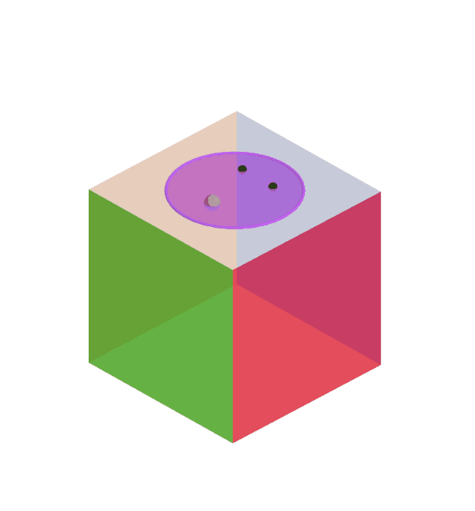

<!-- https://pandoc.org/MANUAL.html -->
\newcommand{\defeq}{\stackrel{\textup{def}}{=}}
\newcommand{\U}{\mathcal{U}}
\newcommand{\BG}{\mathsf{B}G}
\newcommand{\Copy}{\mathrm{Copy}}
\newcommand{\Tor}{\mathsf{Tor}}
\newcommand{\id}{\mathrm{id}}
\newcommand{\Pr}{\mathrm{Pr}}
\newcommand{\gset}{G\text{-}\Set}
\newcommand{\torg}{\Tor_G}
\newcommand{\ad}{\mathrm{ad}}
\newcommand{\pt}{\mathrm{pt}}
\newcommand{\dotto}{\,\cdot\!\to}
\newcommand{\dottol}[1]{\stackrel{#1}{\dotto}}
\newcommand{\icol}[2]{{{#1} \choose {#2}}}
\newcommand{\twist}[2]{{#1}^{\circlearrowleft {#2}}}
\newcommand{\apd}{\mathrm{apd}}
\newcommand{\ap}{\mathrm{ap}}
\newcommand{\tr}{\mathrm{tr}}
\newcommand{\Type}{\mathsf{Type}}
\newcommand{\Inn}{\mathrm{Inn}}
\newcommand{\refl}{\mathrm{refl}}
\newcommand{\Aut}{\mathrm{Aut}}
\newcommand{\im}{\mathrm{im}}
\newcommand{\shape}{\text{∫}}
\newcommand{\shapez}{\text{∫}{}_{0}}
\newcommand{\shapeo}{\text{∫}{}_{1}}
\newcommand{\shapet}{\text{∫}{}_{2}}
\newcommand{\flatdr}{\flat_\mathrm{dR}}
\newcommand{\fbar}{\overline{f}}
\newcommand{\ff}{\mathbb{F}}
\newcommand{\Id}{\mathrm{Id}}
\newcommand{\rr}{\mathbb{R}}
\newcommand{\rrn}{\mathbb{R}^n}
\newcommand{\rrm}{\mathbb{R}^m}
\newcommand{\rrx}{\mathbb{R}[x]/x^2}
\newcommand{\rry}{\mathbb{R}[y]/y^2}
\newcommand{\cc}{\mathbb{C}}
\newcommand{\nn}{\mathbb{N}}
\newcommand{\zz}{\mathbb{Z}}
\newcommand{\kk}{\mathbb{K}}
\newcommand{\ss}{\mathbb{S}}
\newcommand{\dd}{\mathbb{D}}
\newcommand{\vv}{\mathbb{V}}
\newcommand{\Hom}{\mathrm{Hom}}
\newcommand{\Set}{\mathsf{Set}}
\newcommand{\BAut}{\mathsf{BAut}}
\newcommand{\Binn}{\mathsf{Binn}}
\newcommand{\CartSp}{\mathsf{CartSp}}
\newcommand{\fib}{\mathrm{fib}}
\newcommand{\infg}{\infty\text{-groupoid}}
\newcommand{\hquot}{/\!\!/}
\newcommand{\C}{\mathscr{C}}
\newcommand{\E}{\mathscr{E}}
\newcommand{\G}{\mathscr{G}}
\newcommand{\uni}{\mathcal{U}}
\newcommand{\gauge}{\mathcal{G}}
\newcommand{\Ad}{\mathrm{Ad}}
\newcommand{\Gg}{\mathscr{G}}
\newcommand{\Aa}{\mathscr{A}}
\newcommand{\Bb}{\mathscr{B}}
\newcommand{\pathover}[1]{\xrightarrow[{#1}]{=}}

{ width=500 }

## Abstract

We use combinatorial manifolds and torus groups to bring the study of connections on principal bundles into homotopy type theory. We intend this document to be an introduction to modern geometry and gauge theory for anyone familiar with homotopy type theory. Familiarity with [@Symmetry] is helpful.

A literate Markdown+Agda version of this document [is available as well](https://github.com/glangmead/writing/blob/master/differential_geometry_in_hott/agda/discrete_gauge_theory.lagda.md).

<pre class="Agda"><a id="3242" class="Symbol">{-#</a> <a id="3246" class="Keyword">OPTIONS</a> <a id="3254" class="Pragma">--without-K</a> <a id="3266" class="Pragma">--cohesion</a> <a id="3277" class="Pragma">--flat-split</a> <a id="3290" class="Symbol">#-}</a>

<a id="3295" class="Keyword">module</a> <a id="3302" href="discrete_gauge_theory.html" class="Module Operator">discrete_gauge_theory</a> <a id="3324" class="Keyword">where</a>

<a id="3331" class="Keyword">open</a> <a id="3336" class="Keyword">import</a> <a id="3343" href="foundation-core.function-types.html" class="Module">foundation-core.function-types</a>
<a id="3374" class="Keyword">open</a> <a id="3379" class="Keyword">import</a> <a id="3386" href="foundation-core.identity-types.html" class="Module">foundation-core.identity-types</a>
<a id="3417" class="Keyword">open</a> <a id="3422" class="Keyword">import</a> <a id="3429" href="foundation.universe-levels.html" class="Module">foundation.universe-levels</a>
<a id="3456" class="Keyword">open</a> <a id="3461" class="Keyword">import</a> <a id="3468" href="foundation.dependent-pair-types.html" class="Module">foundation.dependent-pair-types</a>
<a id="3500" class="Keyword">open</a> <a id="3505" class="Keyword">import</a> <a id="3512" href="elementary-number-theory.natural-numbers.html" class="Module">elementary-number-theory.natural-numbers</a>
<a id="3553" class="Keyword">open</a> <a id="3558" class="Keyword">import</a> <a id="3565" href="structured-types.pointed-types.html" class="Module">structured-types.pointed-types</a>
<a id="3596" class="Keyword">open</a> <a id="3601" class="Keyword">import</a> <a id="3608" href="synthetic-homotopy-theory.iterated-suspensions-of-pointed-types.html" class="Module">synthetic-homotopy-theory.iterated-suspensions-of-pointed-types</a>
<a id="3672" class="Keyword">open</a> <a id="3677" class="Keyword">import</a> <a id="3684" href="synthetic-homotopy-theory.suspensions-of-types.html" class="Module">synthetic-homotopy-theory.suspensions-of-types</a>
<a id="3731" class="Keyword">open</a> <a id="3736" class="Keyword">import</a> <a id="3743" href="univalent-combinatorics.standard-finite-types.html" class="Module">univalent-combinatorics.standard-finite-types</a>
</pre>
## Real cohesion, discrete types, and $\shape$

We follow [@shulman_cohesion] and [@myersgood]. The modal operator $\shape$ is a reflection from $\Type$ into discrete types $\Type_\shape$. Its unit $(-)^\shape:X\to \shape X$ is implemented as a constructor of a higher inductive type that has four additional constructors. These four constructors assume the existence of a family of types $R_i$ that act collectively as a type of Dedekind real numbers, and they create left and right inverses to the map $\mathsf{const}:X\to (R_i\to X)$.

This localization at the real numbers will take a space $X$ that is a 0-type to its fundamental $\infty$-groupoid as a higher type. So in addition to obtaining the homotopy type of $X$, we import its homotopical information at the appropriate type-theoretic dimension.

We will further assume that if the space $X$ has a finite good open cover $\{U_\alpha\}$, and if the nerve $U_\alpha \to U_{\alpha\beta}\to U_{\alpha\beta\gamma}\to\cdots$ of the good open cover gives the homotopy type of $X$ classically, then we can form a homotopy pushout $HX\defeq 1\to 1\to 1$ from the data of the cover. We claim that $HX$ is discrete and that we have a proof $P:HX\simeq \shape X$.

We will also make use of $n$-truncated shapes, denoted by $\shape{}_n\defeq ||\cdot||_n\circ \shape$.

## Locating curvature

[@myersgood] defines a _1-cover_ to be a $\shapeo$-étale map $\pi:E\to B$ whose fibers are sets. Such a map is classified by (equivalent to) a map $f:\shapeo B \to \Type_{\shapez}$, the type of discrete sets. He speculates that a type of $n$-covers may be of use as well: an _n-cover_ is a $\shape{}_n$-étale map $\pi:E\to B$ whose fibers are $(n-1)$-types.

Let $\ss^n$ be the 0-types given by the unit spheres in $\rr^(n+1)$. Let $U(1)$ be the Lie group of unit complex numbers under multiplication. Classically a $U(1)$ principal bundle over the 2-sphere is a a map $\pi:E\to \ss^2$ such that over contractible neighborhoods $U$ the bundle is trivializable: $\pi |{}_U\simeq U\times U(1)$ and such that $U(1)$ acts on $E$ freely and transitively, and such that $\ss^2\simeq E/U(1)$, i.e. the base is given by taking the quotient of the group action.

Looking through the shape modality we have $\shape\pi:\shape E\to \shape \ss^2$ and we can say a few things:

* The fibers of $\shape\pi$ are merely equivalent to $\shape U(1)$ (i.e. $\shapeo U(1)$).
* $\shape\pi$ is classified by a map $F:\shape B \to \Type_{\shapeo}$.
* $F$ factors through $f:\shape B \to B\shapeo U(1)$.
* $B\shapeo U(1)=\BAut S^1:=(X:Type)\times ||X=S^1||$ where $S^1$ is the higher inductive type

<pre class="Agda"><a id="6418" href="discrete_gauge_theory.html#6418" class="Function">sphere-Pointed-Type</a> <a id="6438" class="Symbol">:</a> <a id="6440" href="elementary-number-theory.natural-numbers.html#732" class="Datatype">ℕ</a> <a id="6442" class="Symbol">→</a> <a id="6444" href="structured-types.pointed-types.html#355" class="Function">Pointed-Type</a> <a id="6457" href="Agda.Primitive.html#915" class="Primitive">lzero</a>
<a id="6463" href="discrete_gauge_theory.html#6418" class="Function">sphere-Pointed-Type</a> <a id="6483" href="discrete_gauge_theory.html#6483" class="Bound">n</a> <a id="6485" class="Symbol">=</a> <a id="6487" href="synthetic-homotopy-theory.iterated-suspensions-of-pointed-types.html#710" class="Function">iterated-suspension-Pointed-Type</a> <a id="6520" href="discrete_gauge_theory.html#6483" class="Bound">n</a> <a id="6522" class="Symbol">(</a><a id="6523" href="univalent-combinatorics.standard-finite-types.html#1747" class="Function">Fin</a> <a id="6527" class="Number">2</a> <a id="6529" href="foundation.dependent-pair-types.html#689" class="InductiveConstructor Operator">,</a> <a id="6531" href="univalent-combinatorics.standard-finite-types.html#7034" class="Function">zero-Fin</a> <a id="6540" class="Number">1</a><a id="6541" class="Symbol">)</a>

<a id="6544" href="discrete_gauge_theory.html#6544" class="Function">sphere</a> <a id="6551" class="Symbol">:</a> <a id="6553" href="elementary-number-theory.natural-numbers.html#732" class="Datatype">ℕ</a> <a id="6555" class="Symbol">→</a> <a id="6557" href="Agda.Primitive.html#388" class="Primitive">UU</a> <a id="6560" href="Agda.Primitive.html#915" class="Primitive">lzero</a>
<a id="6566" href="discrete_gauge_theory.html#6544" class="Function">sphere</a> <a id="6573" class="Symbol">=</a> <a id="6575" href="structured-types.pointed-types.html#488" class="Function">type-Pointed-Type</a> <a id="6593" href="foundation-core.function-types.html#455" class="Function Operator">∘</a> <a id="6595" href="discrete_gauge_theory.html#6418" class="Function">sphere-Pointed-Type</a>

<a id="6616" href="discrete_gauge_theory.html#6616" class="Function">north-sphere</a> <a id="6629" class="Symbol">:</a> <a id="6631" class="Symbol">(</a><a id="6632" href="discrete_gauge_theory.html#6632" class="Bound">n</a> <a id="6634" class="Symbol">:</a> <a id="6636" href="elementary-number-theory.natural-numbers.html#732" class="Datatype">ℕ</a><a id="6637" class="Symbol">)</a> <a id="6639" class="Symbol">→</a> <a id="6641" href="discrete_gauge_theory.html#6544" class="Function">sphere</a> <a id="6648" href="discrete_gauge_theory.html#6632" class="Bound">n</a>
<a id="6650" href="discrete_gauge_theory.html#6616" class="Function">north-sphere</a> <a id="6663" href="elementary-number-theory.natural-numbers.html#753" class="InductiveConstructor">zero-ℕ</a> <a id="6670" class="Symbol">=</a> <a id="6672" href="univalent-combinatorics.standard-finite-types.html#7034" class="Function">zero-Fin</a> <a id="6681" class="Number">1</a>
<a id="6683" href="discrete_gauge_theory.html#6616" class="Function">north-sphere</a> <a id="6696" class="Symbol">(</a><a id="6697" href="elementary-number-theory.natural-numbers.html#766" class="InductiveConstructor">succ-ℕ</a> <a id="6704" href="discrete_gauge_theory.html#6704" class="Bound">n</a><a id="6705" class="Symbol">)</a> <a id="6707" class="Symbol">=</a> <a id="6709" href="synthetic-homotopy-theory.suspensions-of-types.html#2430" class="Function">north-suspension</a>

<a id="6727" href="discrete_gauge_theory.html#6727" class="Function">south-sphere</a> <a id="6740" class="Symbol">:</a> <a id="6742" class="Symbol">(</a><a id="6743" href="discrete_gauge_theory.html#6743" class="Bound">n</a> <a id="6745" class="Symbol">:</a> <a id="6747" href="elementary-number-theory.natural-numbers.html#732" class="Datatype">ℕ</a><a id="6748" class="Symbol">)</a> <a id="6750" class="Symbol">→</a> <a id="6752" href="discrete_gauge_theory.html#6544" class="Function">sphere</a> <a id="6759" href="discrete_gauge_theory.html#6743" class="Bound">n</a>
<a id="6761" href="discrete_gauge_theory.html#6727" class="Function">south-sphere</a> <a id="6774" href="elementary-number-theory.natural-numbers.html#753" class="InductiveConstructor">zero-ℕ</a> <a id="6781" class="Symbol">=</a> <a id="6783" href="univalent-combinatorics.standard-finite-types.html#8675" class="Function">one-Fin</a> <a id="6791" class="Number">1</a>
<a id="6793" href="discrete_gauge_theory.html#6727" class="Function">south-sphere</a> <a id="6806" class="Symbol">(</a><a id="6807" href="elementary-number-theory.natural-numbers.html#766" class="InductiveConstructor">succ-ℕ</a> <a id="6814" href="discrete_gauge_theory.html#6814" class="Bound">n</a><a id="6815" class="Symbol">)</a> <a id="6817" class="Symbol">=</a> <a id="6819" href="synthetic-homotopy-theory.suspensions-of-types.html#2570" class="Function">south-suspension</a>

<a id="6837" href="discrete_gauge_theory.html#6837" class="Function">meridian-sphere</a> <a id="6853" class="Symbol">:</a>
  <a id="6857" class="Symbol">(</a><a id="6858" href="discrete_gauge_theory.html#6858" class="Bound">n</a> <a id="6860" class="Symbol">:</a> <a id="6862" href="elementary-number-theory.natural-numbers.html#732" class="Datatype">ℕ</a><a id="6863" class="Symbol">)</a> <a id="6865" class="Symbol">→</a> <a id="6867" href="discrete_gauge_theory.html#6544" class="Function">sphere</a> <a id="6874" href="discrete_gauge_theory.html#6858" class="Bound">n</a> <a id="6876" class="Symbol">→</a> <a id="6878" href="discrete_gauge_theory.html#6616" class="Function">north-sphere</a> <a id="6891" class="Symbol">(</a><a id="6892" href="elementary-number-theory.natural-numbers.html#766" class="InductiveConstructor">succ-ℕ</a> <a id="6899" href="discrete_gauge_theory.html#6858" class="Bound">n</a><a id="6900" class="Symbol">)</a> <a id="6902" href="foundation-core.identity-types.html#1953" class="Function Operator">＝</a> <a id="6904" href="discrete_gauge_theory.html#6727" class="Function">south-sphere</a> <a id="6917" class="Symbol">(</a><a id="6918" href="elementary-number-theory.natural-numbers.html#766" class="InductiveConstructor">succ-ℕ</a> <a id="6925" href="discrete_gauge_theory.html#6858" class="Bound">n</a><a id="6926" class="Symbol">)</a>
<a id="6928" href="discrete_gauge_theory.html#6837" class="Function">meridian-sphere</a> <a id="6944" href="discrete_gauge_theory.html#6944" class="Bound">n</a> <a id="6946" class="Symbol">=</a> <a id="6948" href="synthetic-homotopy-theory.suspensions-of-types.html#2710" class="Function">meridian-suspension</a>
</pre>
* $\BAut S^1$ is a 2-type, pointed at $S^1$.

We have now imported the type of $U(1)$-principal bundles over $\ss^2$ 

## Visualization

{ width=600 }
<!-- Exportimage("filename", "curved_cube2.gif", "type", "gif", "slider", tt, "loop", false, "time", 10, "width", 600) -->

## Gauge theory

[Gauge theory](https://en.wikipedia.org/wiki/Gauge_theory) is a general methodology for defining invariants of spaces, including invariants of the homotopy type, the homomorphism class, or the diffeomorphism class. We make use of mediating objects such as principal bundles over the space, connections on the bundles, and morphisms of these. These additional objects provide access to information beyond the homology and homotopy groups of the space, but they are also of direct interest as well. In physics the fields that model force fields are connections, and the fields that model matter particles are sections of associated vector bundles. The laws of nature are postulated to be invariant under automorphisms of all the underlying principal bundles, and so all the objects we need to study topology are relevant in physics as well!

The standard treatments of differential geometry and gauge theory work at the infinitesimal level. Connections are differential forms with values in the Lie algebra of a Lie group, rather than functions from finite-length paths directly into the Lie group. This fine local structure is so far inaccessible to homotopy type theory, even with modalities such as those offered by differential cohesion. These modalities are intriguing but very alien to classical intuitions. We won't be saying more about that line of investigation.

John Baez and collaborators [@baez_schreiber_higher_gauge] [@baez_huerta_higher_gauge] have emphasized the *path groupoid* $\mathcal{P}_1(X)$ of a manifold $X$, which is an $n$-category whose points are the points of $X$, whose morphisms are so-called *thin homotopy* classes of smooth paths (paths up to a homotopy that is 1-dimensional, for example a reparameterization of the path that simply changes speed but has the same image and orientation), and where composition of paths is carefully defined so that compositions are always smooth. A connection is then simply a functor $\mathcal{P}_1(X)\to BG$ where $BG$ is a one-object groupoid whose morphisms form the group $G$. 

The path groupoid construction has not been defined in HoTT, and it's not clear that it can be done or whether it's worthwhile to do so. A related object which has been defined in HoTT is the *fundamental groupoid* of $X$, whose points are the points of $X$ and whose paths are homotopy classes of paths. This is the 1-truncation of the full *fundamental $\infty$-groupoid* of $X$ which does not take equivalence classes but retains all the paths and adds higher equalities for the homotopies. Mike Shulman [@shulman_cohesion] and others have developed and extended a system of functions and higher inductive types that act as *modal operators* inside HoTT, with a corresponding topos-theoretic interpretation that extends ideas of Lawvere known as *cohesion*. One of the higher inductive types is called [*shape*](https://ncatlab.org/nlab/show/shape+modality) and when this operator is applied to a 0-type such as a manifold the output is its fundamental $\infty$-groupoid as a higher type. This offers a pathway for classical objects to be imported into type theory, and for us to then define type-theoretic versions of classical constructions such as bundles and connections.

There is another approach, which is to draw inspiration from discrete and combinatorial methods. [Discrete differential geometry](https://en.wikipedia.org/wiki/Discrete_differential_geometry) is an active field of applied mathematics and computer science which has developed combinatorial versions of vector fields, differential forms, connections and curvature, defined on a triangulated surface embedded in 3-dimensional space (as might be used in a computer graphics engine).

## Our objects 1: combinatorial manifolds

](polytope.png "A square pyramid represented visually and by its poset Hasse diagram"){ width=600 }

**[TODO]** Definitions and relations between:

* CW complexes
* simplicial complexes
* polytopes
* PL manifolds

Theorems:

* relationship with homotopy, homeomorphism, smooth structures, depending on dimension
* can we form homotopy pushouts of dyadic posets?

Per Hatcher [@hatcher_at] a *CW complex* is a space $X$ constructed through the following recursive procedure. Start with a set $X_0$, the 0-cells of $X$. Then inductively form the $n$-skeleton from the $n-1$-skeleton by attaching a set of disks via attaching maps of the boundary spheres. If $I_{n}$ is the indexing set at stage $n$, this means forming the pushout
$$\begin{CD}
\coprod_{I_n} S^{n-1} @>\mathrm{attach}>> X_{n-1} \\
@V\mathrm{incl}VV @VVV \\
\coprod_{I_n} D^{n} @>\phi_{I_n}>> X_{n}
\end{CD}
$$
We require each map in the set $\phi_{I_n}$ to be a homeomorphism on the interior of the disk. We will assume we stop at a finite dimension. We will be left with maps $X_0\hookrightarrow X_1\hookrightarrow\cdots\hookrightarrow X_n$ for some finite dimension $n$. 

What topological manifolds are equivalent to a CW complex? The answer is the composition of a few results summarized [by Allen Hatcher](https://mathoverflow.net/questions/201944/topological-n-manifolds-have-the-homotopy-type-of-n-dimensional-cw-complexes) (citing [@kirby_siebenmann] and [@freedman_quinn]):

> Every topological manifold has a handlebody structure except in dimension 4, where a 4-manifold has a handlebody structure if and only if it is smoothable. This is a theorem on page 136 of Freedman and Quinn's book "Topology of 4-Manifolds", with a reference given to the Kirby-Siebenmann book for the higher-dimensional case. It is then an elementary fact that an $n$-manifold with a handlebody structure is homotopy equivalent to a CW complex with one $k$-cell for each $k$-handle, so in particular there are no cells of dimension greater than $n$. At least in the compact case a manifold with a handlebody structure is in fact homeomorphic to a CW complex with $k$-cells corresponding to $k$-handles; see page 107 of Kirby-Siebenmann. This probably holds in the noncompact case as well, though I don't know a reference.

## Our objects 2: groups

We take as our starting point the delooping framework of [@buchholtz2023central]. Consider the central type $S^1$, given as the higher inductive type:

## Polytopes in $BS^1$

Given a nerve $X$, the type of principal $S^1$ bundles over $X$ is the function type $X\to \BAut_1 S^1$.

Given a particular function $f:X\to \BAut_1 S^1$, what does this function do at the various levels of $X$? On terms $x_0:X$ it assigns a particular $S^1$-torsor $f(x_0):\BAut_1 S^1$. On paths $p:x_1=_X x_2$ it assigns an isomorphism of torsors $f(p):f(x_0)=f(x_1)$. 

Next we will form the total space $(x:X)\times f(x)$ and look at what we know about *dependent paths*, also known as *pathovers*. We claim that we can lift paths uniquely to dependent paths in a way that corresponds to a connection on this bundle.

Can this connection be curved, or is it necessarily flat? It can be curved! Consider a path in the Rubik's cube nerve (the octahedron) starting from the top (white) point (which stands in for the whole white face of the cube) and moving to the red point, then green, then back to the white point. Applying $f$ to this loop gives an automorphism of the torsor $f(white)$. This is a group element of the central type $S^1$ which we will name $f(wrgw)$. This can be a non-identity element. But since this path bounds a 2-cell $wrg$ in $X$, there is a 2-path from this loop to $\refl_w$. Is there a path from $f(wrgw)$ to $1_{S^1}$? Yes, the central type $S^1$ is connected so there are various paths we could choose, which differ by winding number. The 2-face will map to this path. **[TODO: detail the 2-type structure of $\BAut_1 S^1$]**

The lifting of paths is a connection, and the assignment of paths $1=_{S^1}g$ to 2-cells is curvature. Classically these are defined infinitesimally as a 1-form and a 2-form, so it's all making sense.

If the map is more than just "the bundle" and contains the data of a curved connection automatically, can we recover the underlying bundle without its connection?

Classically we have that hiccup that connections aren't actually 1-forms, they are points in an affine space modeled on 1-forms. But curvature is an honest 2-form. Can we detect that hiccup here? Yes, in this context we made an arbitrary choice when we assigned $f(white)$. We could slide the whole image of $f$ around in $\BAut_1 S^1$ and get an equivalent bundle and connection. But no matter where we place the octahedron, the curvature assignment is the same, because the choices of torsors cancel out. But do they entirely? If you read classical material very carefully you might notice fine print like this: curvature is defined only up to conjugation! We could have told you that, since all the points in a space of torsors have the same group as the loop space at that point, but they are conjugate to each other. In fact they are merely conjugate, as there are many conjugations (paths between two points) we can choose. A whole torsor's worth!

### Pathovers as horizontal $\times$ vertical

**Lemma** If $X$ is a type and $f:X\to \U$ is a type family, and $x, x':X$, and $y:f(x), y':f(x')$, then we have an equivalence $(x, y) \pathover{} (x', y') \simeq (x=x')\times(y=y)$ of the type of paths over paths in $x=x'$ to the indicated product.**[TODO: prove this generalization of Symmetry Lemma 4.14.1.]**

We can think of the two factors of the equivalence as providing horizontal and vertical components of the path in the total space.

### Gauge transformations

Physicists call automorphisms of the principal bundle *gauge transformations*. **[TODO: explain about torsors and gauges and such]**. This means homotopies of the given bundle $f:X\to \BAut_1 S^1$, i.e. functions of type $(x:X)\to f(x)=f(x)$. 

Donaldson-Kronheimer: “The non-triviality of the orbit space is a reflection of the impossibility of finding a uniform, global procedure by which to pick out a preferred gauge for each equivalence class of connections;” ([Donaldson and Kronheimer, 1997, p. 185](zotero://select/library/items/6SNR3CNY)) ([pdf](zotero://open-pdf/library/items/CIC23ZVM?page=185&annotation=2KPBLMAP))

The action of $\Gg$ on $\Aa$ is not free, even when a connection $A$ is irreducible. The stabilizer of $A$ coincides with the center of $G$. This leads to framed connections.

## Outline version

### Summary of differential geometry, gauge theory, and our crown jewel: Chern-Weil theory

Items that students need to know, that might be especially helpful to see first in this settings:

* tensors and forms
* connections and transport
* classifying spaces and "horizontal vs vertical"
* Chern-Weil theory
* gauge transformations
* [@freed2013chernweil]
* space!

It might be good to follow the narrative of some good books:

Outline of [@baez1994gauge] I-III

* Maxwell's equations
* Manifolds
* Vector fields
* Differential forms
* Rewriting Maxwell's equations
* DeRham theory in electromagnetism
* Symmetry
* Bundles and connections
* Curvature and the Yang-Mills equation
* Chern-Simons theory
* Link invariants from gauge theory
* Semi-Riemannian geometry
* Einstein's equation
* Lagrangians for general relativity
* The ADM formalism
* The new variables

Outline of [@kobayashinomizu] I-III

* Differentiable manifolds
* Tensor algebras
* Tensor fields
* Lie groups
* Fibre bundles
* Connections in a principal fibre bundle
* Existence and extension of connections
* Parallelism
* Holonomy groups
* Curvature form and structure equation
* Mappings of connections
* Reduction theorem
* Holonomy theorem
* Flat connections
* Local and infinitesimal holonomy groups
* Invariant connections
* Connections in a vector bundle
* Linear connections
* Affine connections
* Developments
* Curvature and torsion tensors
* Geodesics
* Expressions in local coordinate systems
* Normal coordinates
* Linear infinitesimal holonomy groups
* ...

Outline of [@kolar_natural_1993] I-IV

* Differentiable manifolds
* Submersions and immersions
* Vector fields and flows
* Lie groups
* Lie subgroups and homogeneous spaces
* Vector bundles
* Differential forms
* Derivations on the algebra of differential forms and the Frölicher-Nijenhuis bracket
* General fiber bundles and connections
* Principal fiber bundles and G-bundles
* Principal and induced connections
* Jets
* Jet groups
* Natural bundles and operators
* Prolongations of principal fiber bundles
* Canonical differential forms
* Connections and the absolute differentiation

Outline of [@hamilton2017]

* Lie groups and Lie algebras
* Group actions
* Fibre bundles
* Connections and curvature
* Spinors
* Lagrangians
* Appendix: tensors and forms

Outline of [@milnor1974characteristic]

* Smooth manifolds
* Vector bundles
* Stiefel-Whitney classes
* Grassmann manifold and universal bundles
* A cell structure for Grassmann manifolds
* The cohomology ring $H^{\bullet} (\mathrm{Gr}_n, \zz/2)$
* Existence of Stiefel-Whitney classes
* Oriented bundles and the Euler class
* The Thom isomorphism theorem
* Computations in a smooth manifold
* Obstructions
* Complex vector spaces and complex manifolds
* Chern classes
* Pontrjagin classes
* Chern numbers and Pontrjagin numbers
* The oriented cobordism ring $\Omega_*$
* Thom spaces and transitivity
* Multiplicative sequences and the signature theorem
* Combinatorial Pontrjagin classes

Outline of [@bott_tu]

* de Rham complex on $\rr^n$
* The Mayer-Vietoris sequence
* Orientation and integration
* Poincaré lemma
* The Mayer-Vietoris argument
* The Thom isomorphism
* The nonorientable case
* The generalized Mayer-Vietoris principle
* More examples and applications of the Mayer-Vietoris principle
* Presheaves and Cech cohomology
* Sphere bundles
* The Thom isomorphism and Poincaré duality revisited
* Monodromy
* The spectral sequence of a filtered complex
* Cohomology with integer coefficients
* The path fibration
* Review of homotopy theory
* Applications to homotopy theory
* Rational homotopy theory
* Chern classes of a complex vector bundle
* The splitting principle and flag manifolds
* Pontrjagin classes
* The search for the universal bundle

### Differential geometry topics to treat in homotopy type theory  (todo list)

* classifying spaces and “horizontal vs vertical”
* gauge transformations
* (Freed & Hopkins, 2013)
* locating connections and curvature
* justifying these names
* Chern-Weil theory
* locating the classical formulas for curvature ($F=dA+\frac{1}{2}A\wedge A$); Bianchi identity
* locating the classical formula for the action of the gauge group on a connection/curvature
* locating the Leibniz rule
* if $\ap$ "is" differentiation, then is $d^2=0$?
* which map from the Rubik's cube is the Hopf bundle?
* Hodge star
* orientation of a bundle
* [Scoccola 05/2020 - Nilpotent Types and Fracture Squares in Homotopy Type Theory](zotero://select/items/1_E7IEEMRP)
* [Cohen - The Topology of Fiber Bundles Lecture Notes](zotero://select/items/1_TX88MRXW)
* intersection forms
* a situation where classically there's an obstruction to a distribution; Lie bracket remaining in subbundle
* Baez Galois theory formulations
* Cohomology as obstructions to lifts (obstruction theory)
* Maximal tori, [splitting principle](https://ncatlab.org/nlab/show/splitting+principle), Leray-Hirsch theorem

## References
