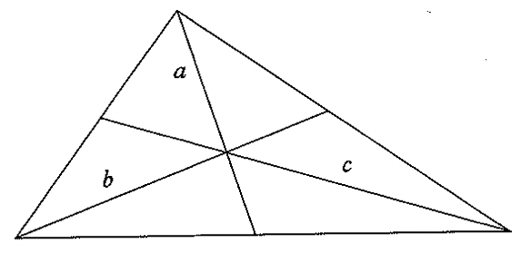

# Sense and Reference (1892)

On this reading, the paper _Sense and Reference_ made a little less sense than previous attempts. I suspect it may be because I find the core idea so natural that the additional examples and scope of the later sections feels like overreach.

The central example of this paper is to compare

    a = a

from

    a = b

where an illustrative example of a = b might be Frege's triangle with bisecting diagonals: draw a line from each vertex, which bisects the opposite side. These three segments meet at a point in the middle:

and so we can form "the point of intersection of a and b" and "the point of intersection of b and c", and these end up being the same point as each other, but something about these two descriptions differs. He calls it

> a difference in the mode of presentation

or 

> different designations for the same point

Or "sign" versus "signified". He appaars to assume that the _signified_ part is more intuitive for the reader, and so he wants to split off the sign, the sense, the mode of presentation.

> besides that which the sign designates, which may be called the _Bedeutung_ of the sign, also what I should like to call the _sense_ of the sign, wherein the mode of presentation is contained.

> The _Bedeutung_ of 'Evening Star' would be the same as that of 'Morning Star', but not the sense.

He makes a couple clarifications.

> The words 'the celestial body most distant from the Earth' have a sense, but it is very doubtful if they also have a _Bedeutung_.

> Comprehensive knowledge of the _Bedeutung_ would require us to be able to say immediately whether any given sense attaches to it. To such knowledge we never attain.

A third term he wants to keep separate is "idea", which is subjective and private to each person.

He compares the actual Moon to a reference, the image it makes in the optics of a telescope to the sense, and the image it makes in one person's retina the idea. He has no interest in ideas going forward.

An assertion, or proposition, has as its reference a truth value. So every True assertion has the same reference!

